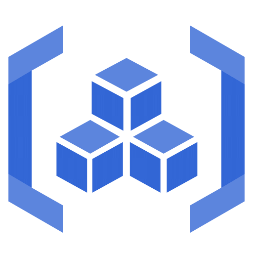
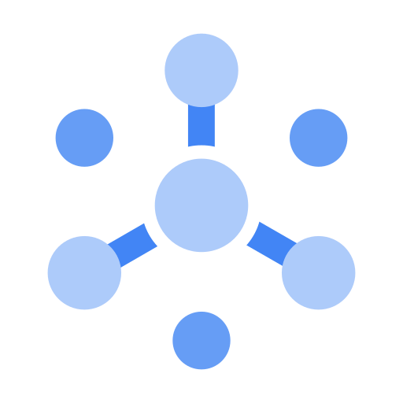

## GCP-streaming-pipeline: Data Pipeline for ingest data in near real time

## Project Summary

This project aims to develop a data pipeline for consuming API data in near real time.
The pipeline will be responsible for extracting data from an API, transforming it into a suitable format, and loading it into a data storage system.
The pipeline will be implemented using Google Cloud Platform (GCP) services, including Cloud Pub/Sub, Cloud Run, and Cloud Storage and Cloud BigQuery.

## Development Stack

## Cloud Stack (GCP)

- Cloud Build: Continuous Integration and Continuous Deployment (CI/CD) service provided by GCP integrated with GitHub Actions
- Artifact Registry: Private Docker container registry provided by GCP for storing FastAPI image.
- Cloud Run: Fully managed serverless container runtime provided by GCP for running FastAPI Application.
- Pub/Sub: Messaging service provided by GCP for sending and receiving messages between FastAPI and Dataflow pipeline.
- Dataflow: Serverless data processing service provided by GCP for executing the ETL process.
- BigQuery: Fully managed, serverless data warehouse provided by GCP for storing and analyzing large datasets.

## Continuous Integration and Continuous Deployment (CI/CD, DevOps)

## Contributing

See the following docs:

- [Contributing Guide](https://github.com/IvanildoBarauna/GCP-streaming-pipeline/blob/main/CONTRIBUTING.md)
- [Code Of Conduct](https://github.com/IvanildoBarauna/GCP-streaming-pipeline/blob/main/CODE_OF_CONDUCT.md)

## Project Highlights:

- Hexagonal Architecture: Adoption of Hexagonal Architecture to decouple the core logic from external dependencies, ensuring that any current data source can be replaced seamlessly in case of unavailability. This is facilitated by the use of adapters, which act as intermediaries between the core application and the external services.

- Comprehensive Testing: Development of tests to ensure the quality and robustness of the code at various stages of the ETL process

- Fire-Forget Messaging: Use of messaging (Cloud PubSub) in the fire-forget model to manage files generated between the transformation and loading stages, ensuring a continuous and efficient data flow.

- Configuration Management: Use of a configuration module to manage project_id and others env variables, providing flexibility and ease of adjustment.

- Continuous Integration and Continuous Deployment: Use of CI/CD pipelines to automate the build, test and deployment processes, ensuring that the application is always up-to-date and ready for use.

- Code Quality: Use of code quality tools such as linters and formatters to ensure that the codebase is clean, consistent and easy to read.

- Documentation: Creation of detailed documentation to facilitate the understanding and use of the application, including installation instructions, usage examples and troubleshooting guides.

# Data Pipeline Process:

1. Datasource: The data source is an API that provides data in real time. The API returns the data in JSON format. (The implementation of the API is part of the project, so it is not necessary to make requests to an external API).
2. Data Extraction: The data extraction process consists of making requests to the API to obtain the data. The requests are made in parallel workers using Cloud Dataflow to optimize the process. The data is extracted in JSON format.
3. Data Transformation: The data transformation process consists of converting the data to BigQuery Schema. The transformation is done using Cloud Dataflow in parallel workers to optimize the process.
4. Data Loading: The data loading process consists of loading the data into BigQuery. The data is loaded in parallel workers using Cloud Dataflow to optimize the process.